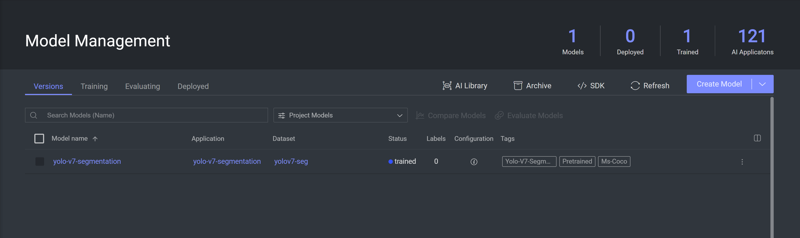
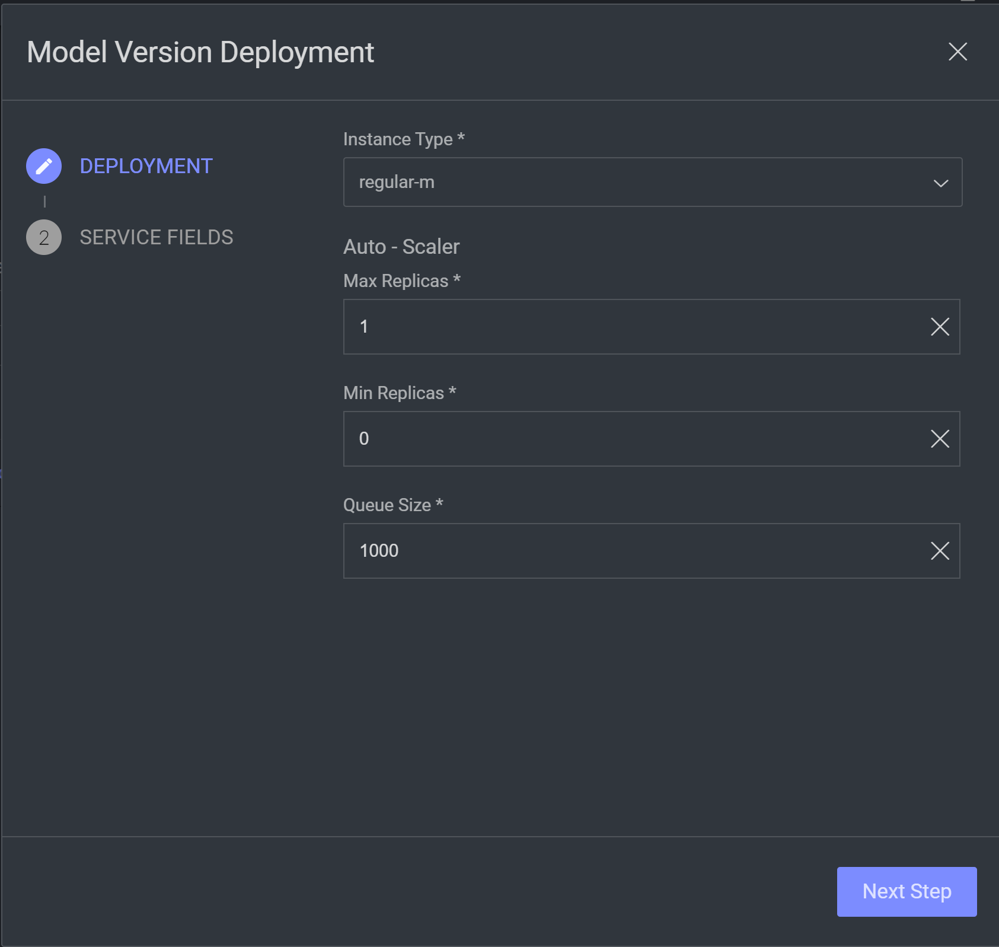
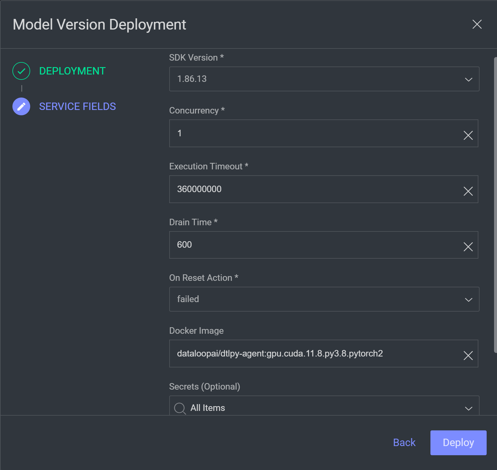
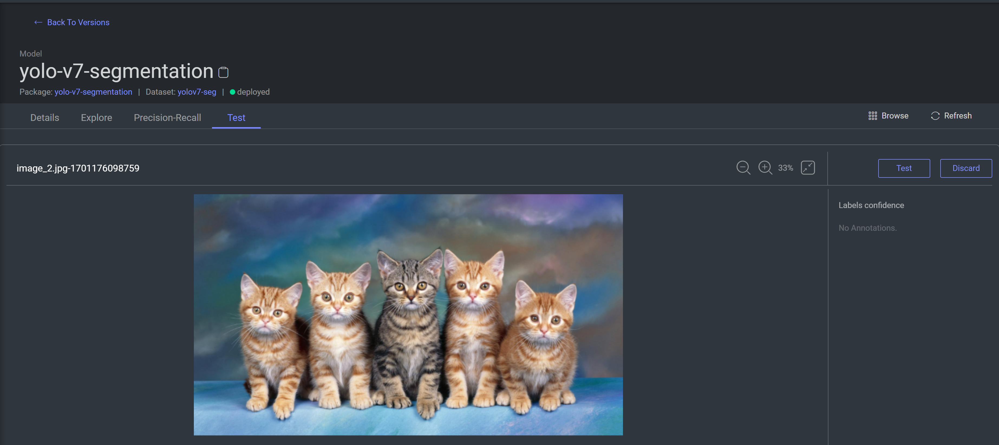
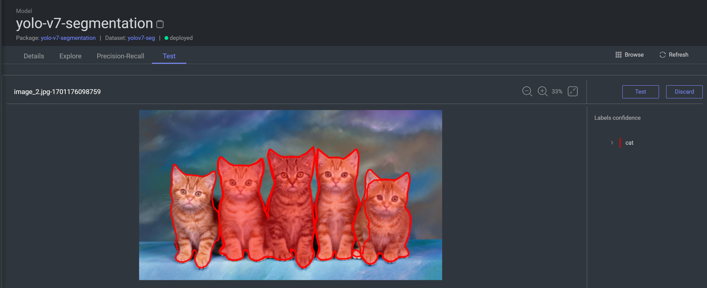
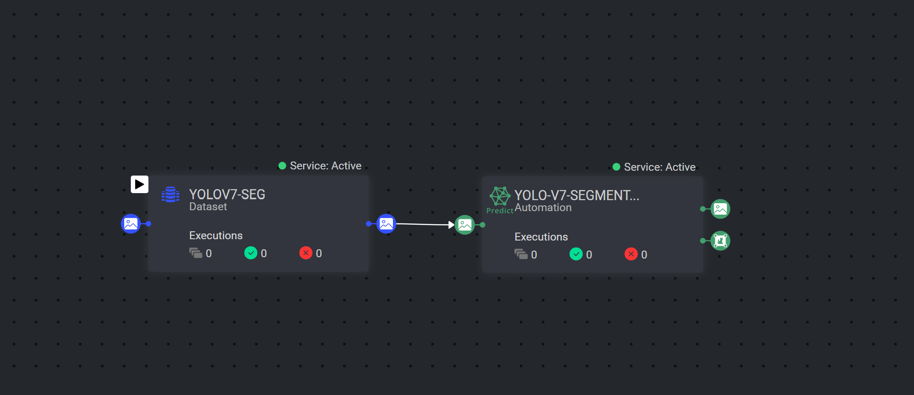

# YOLOv8 Segmentation Model Adapter

## Introduction

This repo is a model integration between [YOLOv7-Instance-Segmentation](https://github.com/RizwanMunawar/yolov7-segmentation) segmentation model and [Dataloop](https://dataloop.ai/)

## Requirements

- dtlpy
- matplotlib
- numpy>=1.24.4 
- opencv-python>=4.1.1 
- Pillow>=7.1.2 
- PyYAML>=5.3.1 
- requests>=2.23.0 
- torchvision
- tqdm>=4.64.0
- protobuf<=3.21.6
- tensorboard>=2.4.1
- pandas>=1.1.4
- seaborn>=0.11.0
- filterpy
- thop>=0.1.1 

### Installing in the Platform

To clone the model from our AI Library, review our [documentation]()

### Installing via the SDK

To install YOLOv7-segmentation via SDK, all that is necessary is to clone the model from the AI Library to your own project:

```python
import dtlpy as dl
project = dl.projects.get('My Project')
public_model = dl.models.get(model_name="yolov7-segmentation")
model = project.models.clone(from_model=public_model,
                             model_name='yolov7-segmentation-clone',
                             project_id=project.id)
```

For more options when installing the model, check this [page](https://developers.dataloop.ai/tutorials/model_management/ai_library/chapter/#finetune-on-a-custom-dataset).

## Training and Fine-tuning

Training Yolov7 Segmentation model is currently not supported. 

### Editing the configuration

To edit configurations via the platform, go to the YOLOv7-segmentation page in the Model Management and edit the json file displayed there or, via the SDK, by editing the model configuration. Click [here](https://developers.dataloop.ai/tutorials/model_management/ai_library/chapter/#model-configuration) for more information.

The basic configurations included are:

* ```weights_filename```: name of the model weigths file (default: yolov7-seg.pt)
* ```data```: labels file (default: coco.yaml)
* ```epochs```: number of epochs to train the model (default: 5)
* ```batch_size```: batch size to be used during the training (default: 32)
* ```imgsz_w```: the width to which images are reshaped before going through the model (default: 1280)
* ```imgsz_h```: the height to which images are reshaped before going through the model (default: 1280)
* ```device```: whether to train on ```cpu``` or ```cuda``` (default to automatic detection of whether the instance has a cpu)

## Deployment

After installing the pretrained model or fine-tuning it on your data, it is necessary to deploy it, so it can be used for prediction.

### Deploying with the Platform

In the Model Management page of your project, find a pretrained or fine-tuned version of your YOLOv8-segmentation model and click the three dots in the right of the model's row and select the "Deploy" option:



Here you can choose the instance, minimum and maximum number of replicas and queue size of the service that will run the deployed model (for more information on these parameters, check [the documentation](https://developers.dataloop.ai/tutorials/faas/advance/chapter/#autoscaler)):



Proceed to the next page and define the service fields (which are explained [here](https://developers.dataloop.ai/tutorials/faas/custom_environment_using_docker/chapter/)).



After this, your model is deployed and ready to run inference.

### Deploying with the SDK

To deploy with the default service configuration defined in the package:

```python
model_entity = dl.models.get(model_id='<model-id>')
model_entity.deploy()
```

For more information and how to set specific service settings for the deployed model, check the [documentation](https://developers.dataloop.ai/tutorials/model_management/ai_library/chapter/#clone-and-deploy-a-model).

## Testing

Once the model is deployed, you can test it by going to the Model Management, selecting the YOLOv8-segmentation model and then going to the test tab. Drag and drop or select an image to the image area:



click the test button and wait for the prediction to be done:



## Prediction

### Predicting in the Platform

The best way to perform predictions in the platform is to add a "Predict Node" to a pipeline:



Click [here](https://developers.dataloop.ai/onboarding/08_pipelines/) for more information on Dataloop Pipelines.

### Predicting with the SDK

The deployed model can be used to run prediction on batches of images:

```python
import dtlpy as dl
model_entity = dl.models.get(model_id='<model-id>')
results = model_entity.predict_items([item_id_0, item_id_1, ..., item_id_n])
print(results)
```

For more information and options, [check the documentation](https://developers.dataloop.ai/tutorials/model_management/ai_library/chapter/#predict-items).